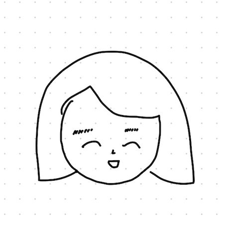
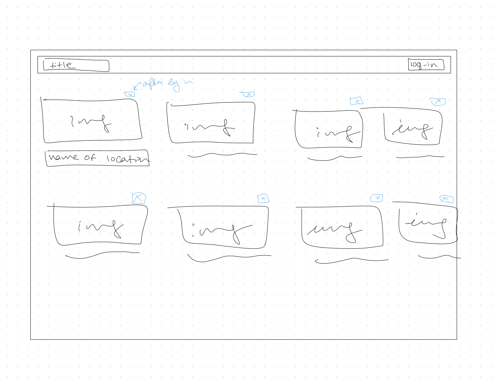
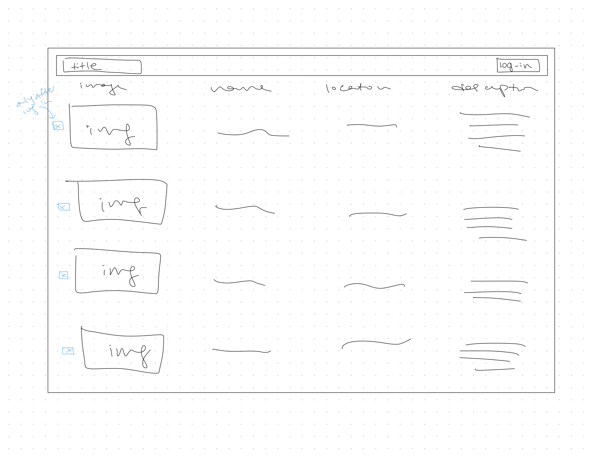
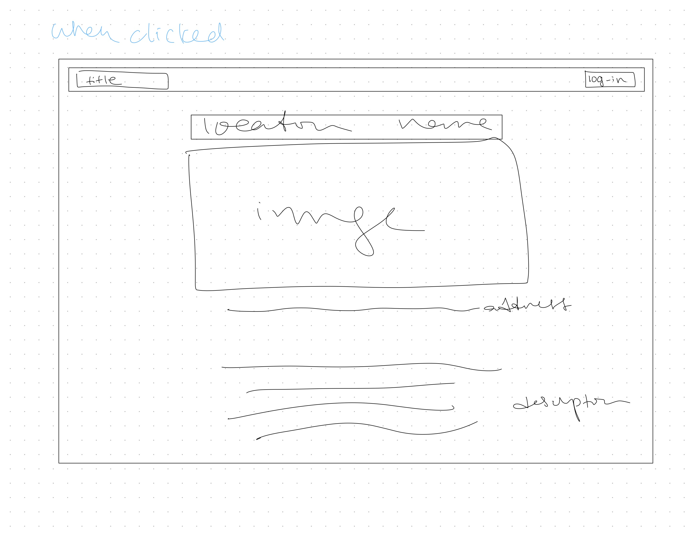
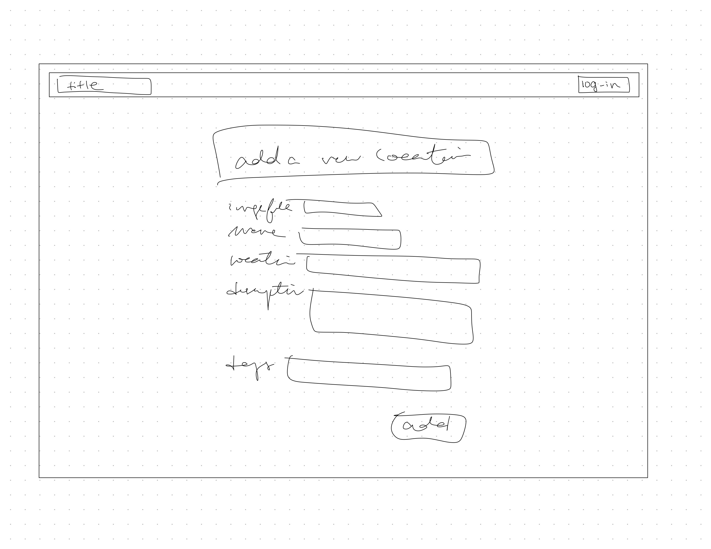
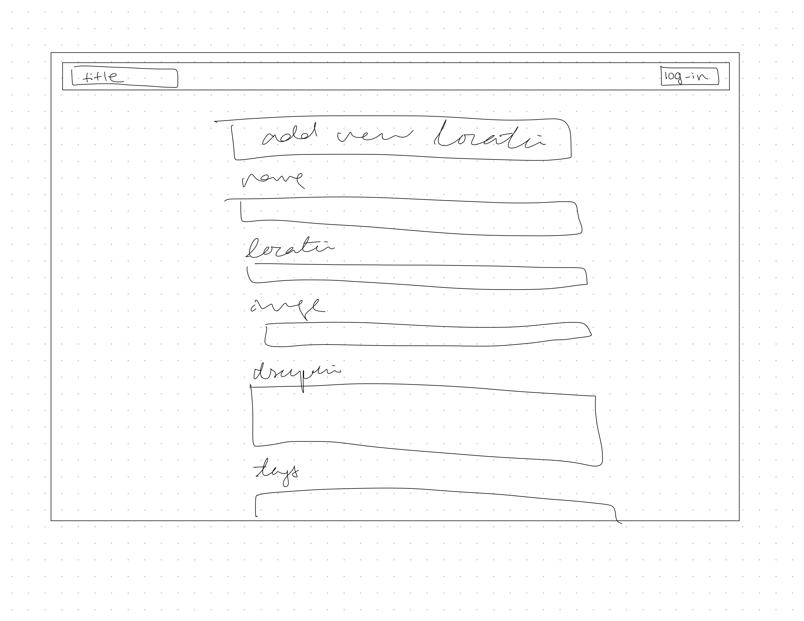
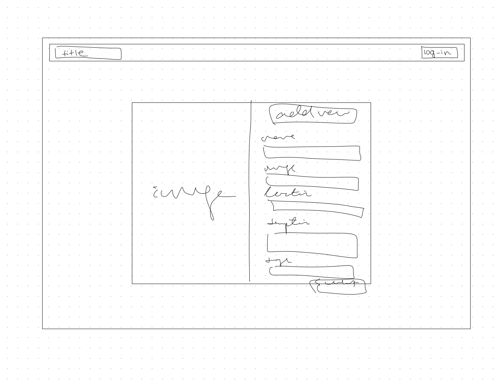

# Project 3: Design Journey

**For each milestone, complete only the sections that are labeled with that milestone.** Refine all sections before the final submission.

You are graded on your design process. If you later need to update your plan, **do not delete the original plan, rather leave it in place and append your new plan _below_ the original.** Then explain why you are changing your plan. Any time you update your plan, you're documenting your design process!

**Replace ALL _TODOs_ with your work.** (There should be no TODOs in the final submission.)

Be clear and concise in your writing. Bullets points are encouraged.

**Everything, including images, must be visible in _Markdown: Open Preview_.** If it's not visible in the Markdown preview, then we can't grade it. We also can't give you partial credit either. **Please make sure your design journey should is easy to read for the grader;** in Markdown preview the question _and_ answer should have a blank line between them.

## Design Plan (Milestone 1)

**Make the case for your decisions using concepts from class, as well as other design principles, theories, examples, and cases from outside of class (includes the design prerequisite for this course).**

You can use bullet points and lists, or full paragraphs, or a combo, whichever is appropriate. The writing should be solid draft quality.

### Catalog (Milestone 1)

> What will your catalog website be about? (1 sentence)

My catalog will be about places on Cornell's campus

### _Consumer_ Audience (Milestone 1)

> Briefly explain your site's _consumer_ audience. Your audience should be specific, but not arbitrarily specific. (1 sentence)
> Justify why this audience is a **cohesive** group. (1-2 sentences)

My sites audience is the "Cornell family": students, alumni, professors, high school applicants, etc. Basically, anyone that is associated with or curious about Cornell.

This is a cohesive audience because they are all interested in Cornell's campus. Whether it be looking for study spots, date spots, or pretty locations on campus, all of the members of my audience are curious about LOCATIONS or where to go on cornell's campus.

### _Consumer_ Audience Goals (Milestone 1)

> Document your _consumer_ audience's goals for using this catalog website.
> List each goal below. There is no specific number of goals required for this, but you need enough to do the job (Hint: It's more than 1. But probably not more than 3.)
> **Hint:** Users will be able to view all entries in the catalog and insert new entries into the catalog. The audience's goals should probably relate to these activities.

Goal 1: See what different locations are on campus

- **Design Ideas and Choices** _How will you meet those goals in your design?_
  - I will put images and labels on the catalog page so that all the locations are clearly visible. I will organize them in a manner that shows alot of locations at once, but not so much that users cannot process it easily.
- **Rationale & Additional Notes** _Justify your decisions; additional notes._
  - This is because the main goal of my site is to show locations. If I am not able to organize them in a way that is good for users, the main purpose of my site is not being fulfilled. Images and labels are because much of my audience does not know the actual names of the locations, but knows visually what they are looking for.

Goal 2: Find locations of similar themes such as study spots, or date locations, etc.

- **Design Ideas and Choices** _How will you meet those goals in your design?_
  - I will allow users to input tags to describe their location.
- **Rationale & Additional Notes** _Justify your decisions; additional notes._
  - By using tags, users will be able to group together different locations based on tags, or search tags to find specific types of locations that they are looking for.

### _Consumer_ Audience Device (Milestone 1)

> How will your _consumer_ audience access this website? From a narrow (phone) or wide (laptop) device?
> Justify your decision. (1 sentence)

My consumer audience will access this website from a laptop device. Catalogs are easier to access from a wide device, and for college students who are always on their computers, it is more likely that they will search where to go next, or go on the weekend from their computer. Also if they are potentially planning a day, they are likely to want to use multiple tabs and search more about the locations they see, therefore a laptop is the better option.

### _Consumer_ Persona (Milestone 1)

> Use the goals you identified above to develop a persona of your site's _consumer_ audience.
> Your persona must have a name and a face. The face can be a photo of a face or a drawing, etc.



Rachel

**Factors that Influence Behavior:**

- where their classes are on campus
- the weather/season
- locations they have access to because shes just a student

**Goals:**

- Rachel's goal is to find nice indoor study spots on campus.

**Obstacles:**

- Rachel lives on North campus, so some locations are too far to walk
- There are so many study spots and its hard to choose from
- Rachel doesn't like normal libraries

**Desires:**

- Rachel wants to find more open study locations that are indoor and closer to her dorm.

### _Administrator_ Audience (Milestone 1)

> Briefly explain your site's _administrator_ audience. Your audience should be specific, but not arbitrarily specific. (1 sentence)
> Justify why this audience is a **cohesive** group. (1-2 sentences)

My administrator audience are members of the Cornell family who were approved by the managers of the site to add/edit locations around campus. They have to either be students or staff at Cornell.

This is a cohesive audience because they are all people affiliated with Cornell that have a love for the school and its campus. They applied to be an administrator of the site and are given the login information because of their knowledge of campus.

### _Administrator_ Audience Goals (Milestone 1)

> Document your _administrator_ audience's goals for using this catalog website.
> List each goal below. There is no specific number of goals required for this, but you need enough to do the job (Hint: It's more than 1. But probably not more than 3.)
> **Hint:** Users will be able to view all entries in the catalog and insert new entries into the catalog. The audience's goals should probably relate to these activities.

Goal 1: Delete locations that are currently on the catalog

- **Design Ideas and Choices** _How will you meet those goals in your design?_
  - I will create an delete button for each entry in the catalog that allows users who log in to delete entries that they feel are unfit.
- **Rationale & Additional Notes** _Justify your decisions; additional notes._
  - This is because administrator users want to be able to access what is currently on the catalog and if a location changes, or access to it changes, etc, these users can simply delete the entry from the site.

Goal 2: Add new locations to the catalog

- **Design Ideas and Choices** _How will you meet those goals in your design?_
  - I will create a form page that can only be accessed by users that log in. They will be able to input a location, a description of the location, tags, etc.
- **Rationale & Additional Notes** _Justify your decisions; additional notes._
  - I will use a form becuase that is the easiest way to input data and display it on the site. This will be the best way for users to log in, and then see a form that will allow them to input data.

### _Administrator_ Persona (Milestone 1)

> Use the goals you identified above to develop a persona of your site's _administrator_ audience.
> Your persona must have a name and a face. The face can be a photo of a face or a drawing, etc.


Sam

**Factors that Influence Behavior:**

How many different locations he visited that week
Which locations on the catalog hes familiar with and wants to change

**Goals:**

Add locations to the catalog
Remove locations to the catalog

**Obstacles:**

Need to know the locations well
Have to visit different locations but some are far from his dorm
Some locations and descriptions on the catalog he disagrees with

**Desires:**

Wants to share with other members of Cornell good places to be on campus
Wants all the locations on the catalog to be the best description of the place as possible

### Catalog Data (Milestone 1)

> Using your personas, identify the data you need to include in the catalog for your site's audiences.
> Justify why this data aligns with your persona's goals. (1 sentence)

- Location name
- short description
- tags about type of location
- image/photo
- location address

This data will give a full description of the location on campus, including where it is, what is is good for, etc.

### Site Design (Milestone 1)

> Design your catalog website to address the goals of your personas.
> Sketch your site's design:
>
> - These are **design** sketches, not _planning_ sketches.
> - Use text in the sketches to help us understand your design.
> - Where the content of the text is unimportant, you may use squiggly lines for text.
> - **Do not label HTML elements or annotate CSS classes.** This is not a planning sketch.
>
> Provide a brief explanation _underneath_ each sketch. (1 sentence)
> **Refer to your persona by name in each explanation.**




These first two sketches are sketches of the main page. I made two different version, one where the information is organized into blocks, and one where they are organized in columns.
The first design is more of an aesthetic design. The emphasis is on the image and name of the location and other information is hidden until the user clicks on the image.
The second design displays all the information on the page without users having to click to see more. They do have the option to if they want to, but its not necessary.
I decided to go with the design of the first sketch. It provides more visibility to the user and doesn't clutter the page. However, I will likely use 3 columns instead of 4 so that the user can see the images of the locations more clearly.



This is a sketch of the page that will pop up when the user clicks on a catalog item. It is a blown up picture of the image as well as all the other information that is necessary for the location such as the address or description.







These three sketches are sketches of the form for my administrator audience. All of the forms require the same information, but they are different designs. The first design is very basic with the label to the left of the input box. The second sketch has the label above the input box. This looks much more organized and is easier for the user to follow along the page. The final sketch was built off the second sketch to make the form a bit more aesthetic with an image attached on the left side of the form.

I will likely go with the second sketch that I used just for simplicity. Yes, the third sketch is more aesthetic but because this form has multiple inputs to fill out, it may be more organized and clearer for my personas if only the form was visible, not the form with an image.

### Catalog Design Patterns (Milestone 1)

> Explain how you used design patterns in your site's design. (1-2 sentences)

I used list design patterns in my catalog whether it be column or row because a list keeps information organized. It also makes sure that my content is lined up and pleasant for users to follow with their eyes.

## Implementation Plan (Milestone 1, Milestone 2, Milestone 3, Final Submission)

### Database Schema (Milestone 1)

> Plan the structure of your database. You may use words or a picture.
> A bulleted list is probably the simplest way to do this.
> Make sure you include constraints for each field.

Table: location_tags

- id: INTEGER {PK, NN, AI, U},
- location_id: INTEGER {FK, NN},
- tag_id: INTEGER {FK, NN}
- file_name TEXT {NN}
- file_ext TEXT {NN}
- source TEXT

Table: locations

- id: INTEGER {PK, NN, AI, U},
- name: TEXT {NN, U},
- address: TEXT {},
- description: TEXT {NN}

Table: tags

- id: INTEGER {PK, NN, AI, U},
- tag: TEXT {NN}

### Database Query Plan (Milestone 1, Milestone 2, Milestone 3, Final Submission)

> Plan _all_ of your database queries.
> You may use natural language, pseudocode, or SQL.

```
'Duffield Atrium',
'343 Campus Rd, Ithaca, NY 14853',
"The atrium's natural light and comfortable seating arrangements make it an ideal place for students to focus on their studies or collaborate with peers. With its central location on campus, the Duffield Atrium is easily accessible, and its serene ambiance provides a welcome escape from the hustle and bustle of campus life. Whether you're looking for a quiet place to study or a spot to work on group projects, the Duffield Atrium is a great option for Cornell students."
tag: study spot

```

```
'Olin Library Basement',
'161 Ho Plaza, Ithaca, NY 14853',
"The Olin Library Basement at Cornell University is a great study spot for both individuals and groups. Unlike other quiet study spaces on campus, the basement offers a more relaxed atmosphere that is suitable for collaboration and discussion. Equipped ample table space, it's a great spot for group projects or studying with friends. Additionally, the basement is open until midnight, making it a convenient option for evening study sessions. Although it may not be the best place for individual, quiet study, it's definitely worth considering if you're looking for a more relaxed environment that still offers a productive atmosphere."
tags: study spot
```

```
'Beebe Lake',
"Beebe Lake, situated in the heart of Cornell University, is a charming and romantic destination that's perfect for a special date. With its stunning natural beauty and serene atmosphere, it's an ideal spot for a romantic picnic or a leisurely stroll with a loved one. Its tranquil surroundings and picturesque views make for an unforgettable setting that's sure to impress."
tags: nature spot, date spot
```

```
'Upson Hall',
'124 Hoy Rd, Ithaca, NY 14850',
"Upson Hall at Cornell University is a great study space for students. The building features several study lounges, classrooms, and seminar rooms that provide a quiet and focused environment for students to study and work on group projects. Its central location on the engineering quad provides easy access to other academic buildings and resources, including the engineering library. Upson Hall is equipped with high-speed internet and printing resources, making it easy for students to access and print study materials. Additionally, students can take advantage of the building's state-of-the-art research facilities for unique opportunities to engage in cutting-edge research in their respective fields. Overall, Upson Hall is an ideal location for students to engage in focused study and collaboration with peers.."
tags: study spot
```

```
'Sage Hall',
'114 E Ave, Ithaca, NY 14853',
"Sage Hall at Cornell University is a popular study space for students in the Johnson Graduate School of Management. The building features several study lounges and classrooms that provide a quiet and focused environment for students to study and work on group projects. Its central location on the main campus provides easy access to other academic buildings and resources. The building's café is also a popular spot for students to grab a quick bite to eat or a coffee before settling in for a study session. Sage Hall is equipped with high-speed internet and printing resources, making it easy for students to access and print study materials."
tags: food spot, study spot
```

```
'Novicks Cafe',
'155 Program House Dr, Ithaca, NY 14850',
"Novack's Café is a popular coffee shop located in the center of Cornell University's campus. The café offers a cozy atmosphere with ample seating for students to study, work on group projects, or catch up with friends. Its central location makes it an ideal meeting spot for students before or after classes.

Novack's Café serves a variety of coffee and tea options, as well as light snacks and pastries. The café is known for its delicious coffee and friendly service, making it a favorite spot for many Cornell students. Novack's also provides high-speed internet and printing resources, making it easy for students to access and print study materials as needed.

Overall, Novack's Café is a great study spot for students at Cornell University. Its cozy atmosphere, delicious coffee, and convenient location make it an ideal place for students to study and socialize."
tags: food spot
```

```
'Cascadilla Trail',
"Cascadilla Gorge Trail is a picturesque nature spot located on the campus of Cornell University, making it an ideal location for a date or casual outing. The trail offers a beautiful and scenic hike through a gorge that features several waterfalls and natural rock formations. The trail is accessible year-round, but it is especially beautiful in the spring and fall.

The trailhead is located near several campus buildings, making it an easy and convenient spot to access. The trail is not overly strenuous and is suitable for all levels of hikers. It is a great way to get outside and enjoy nature without having to leave campus.

Along the trail, there are several benches and picnic areas, providing opportunities for a romantic picnic or a casual snack break. The natural beauty of the trail also offers great photo opportunities for couples looking to capture a special moment.

Overall, Cascadilla Gorge Trail is an excellent option for a date or casual outing on the Cornell University campus. Its natural beauty, convenient location, and accessibility make it a great place to enjoy the outdoors and spend quality time with a loved one."
tags: date spot, nature spot
```

## Complete & Polished Website (Final Submission)

### Accessibility Audit (Final Submission)

> Tell us what issues you discovered during your accessibility audit.
> What do you do to improve the accessibility of your site?

The first issue I encountered was low contrast errors on the text in my form. To fix this issue I changed the color of the font.

The second issue I encountered was that my checkboxes did not have proper labels. To fix this, I made the "id" in <input> for each of the checkboxes the id of the location. I also made that the "for" in <label>

### Self-Reflection (Final Submission)

> Reflect on what you learned during this assignment. How have you improved from Projects 1 and 2?

This assignment took much more effort than possibly project 1 and 2 combined. I think I got through project 1 and 2 without necessarily understanding what was completely going on and just used snippets of code from class, or if there was an error I was able to easily debug it using trial and error. For project 3, especially with milestones 3 and final, I found myself really digging deeper into the code and understanding how everything was connected. Trial and error was just not an option and only when I really understood what was happening underneath I was able to debug my code and have my site show what I wanted it to.

> Take some time here to reflect on how much you've learned since you started this class. It's often easy to ignore our own progress. Take a moment and think about your accomplishments in this class. Hopefully you'll recognize that you've accomplished a lot and that you should be very proud of those accomplishments! (1-3 sentences)

I've learned so much from 2300. Not only did my basic understanding of design and how to use HTML and CSS improve, but by using php within my code, I was able to really learn how to debug and code effectively. Debugging was an extremely fun part of this class as I found so much safistication when finding an error and being able to fix it myself, even if it took hours.

### Collaborators (Final Submission)

> List any persons you collaborated with on this project.

None

### Reference Resources (Final Submission)

> Please cite any external resources you referenced in the creation of your project.
> (i.e. W3Schools, StackOverflow, Mozilla, etc.)

W3Schools, StackOverflow, Mozilla

### Grading: User Accounts (Final Submission)

> The graders will need to log in to your website.
> Please provide the usernames and passwords.

**Administrator User:**

- Username: esther
- Password: monkey
- can access the form and can delete entries

**Consumer User:**

- Username: nicole
- Password: monkey
- can only access the form

**Note:** Not all websites will support consumer log in. If your website doesn't, say so.

### Grading: Step-by-Step Instructions (Final Submission)

> Write step-by-step instructions for the graders.
> The project if very hard to grade if we don't understand how your site works.
> For example, you must log in before you can delete.
> For each set of instructions, assume the grader is starting from /

_View all entries:_

1. Home page
2. or click "Explore Cornell" at the top left

_View all entries for a tag:_

1. Click on a tag right under the nav bar
2. Ex: Study Spot, Date Spot, etc

_View a single entry's details:_

1. Click on either the image or the name of the location to view details
2. Can be clicked on from both the home page and from any of the tag pages

_How to insert and upload a new entry:_

1. Log in using the "Log In" link on the right side of the nav bar (anyone logged in can access the form)
2. Once you log in, there should now be a form link on the right side of the nav bar.
3. Fill in the form and click "Submit"
4. Look at confirmation details and return to home

_How to delete an entry:_

1. Log in using the "Log In" link on the right side of the nav bar (HAS TO BE AN ADMINISTRATOR USER)
2. Should take you directly to the home page where now each of the entries has a box with the text "delete" somewhere on it
3. Click on the box and you should be brought to a "confirm deletion" page.
4. Click "confirm" and your entry should now be deleted.
5. Look at confirmation details and return to home
